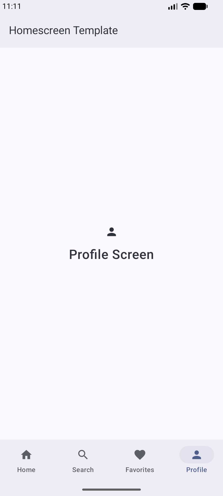

# Homescreen Template (Kotlin & Jetpack Compose 2026)

A modern, production-ready Android Homescreen Template built with 100% Kotlin and Jetpack Compose, featuring Material 3, dynamic color (Material You), edge-to-edge support, and Navigation Compose.

## App Preview

## Tech Stack & Architecture

- **Language:** Kotlin 2.x
- **UI:** Jetpack Compose + Material 3
- **Navigation:** Navigation Compose (Single Activity Architecture)
- **Theming:** Material 3 with Dynamic Color and Edge-to-Edge display
- **Build System:** Version Catalog (`libs.versions.toml`) & Gradle Kotlin DSL

## Tabs

1. **Home** (Dashboard / Main Feed)
2. **Search** (Discovery / Filter)
3. **Favorites** (Bookmarked Items)
4. **Profile** (Settings & Account)
